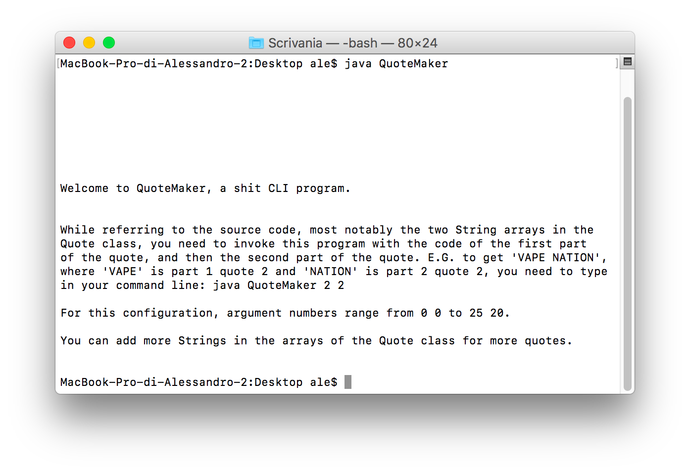
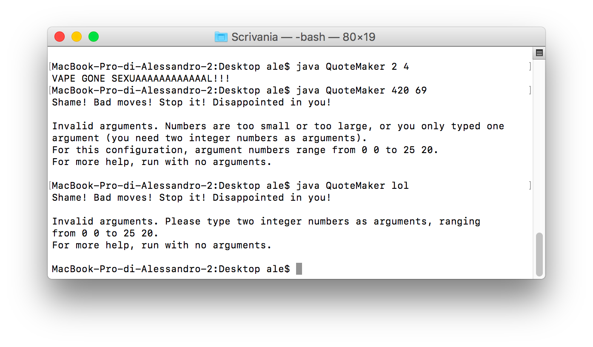
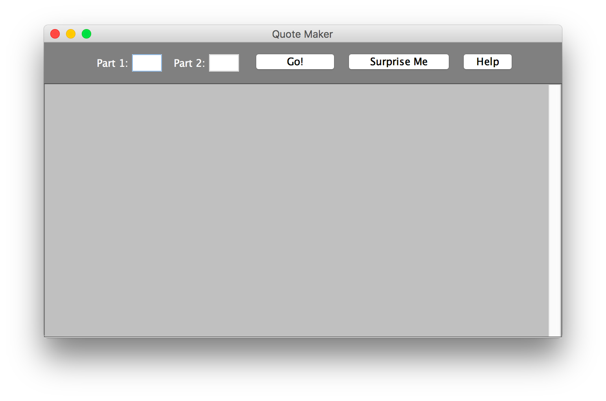
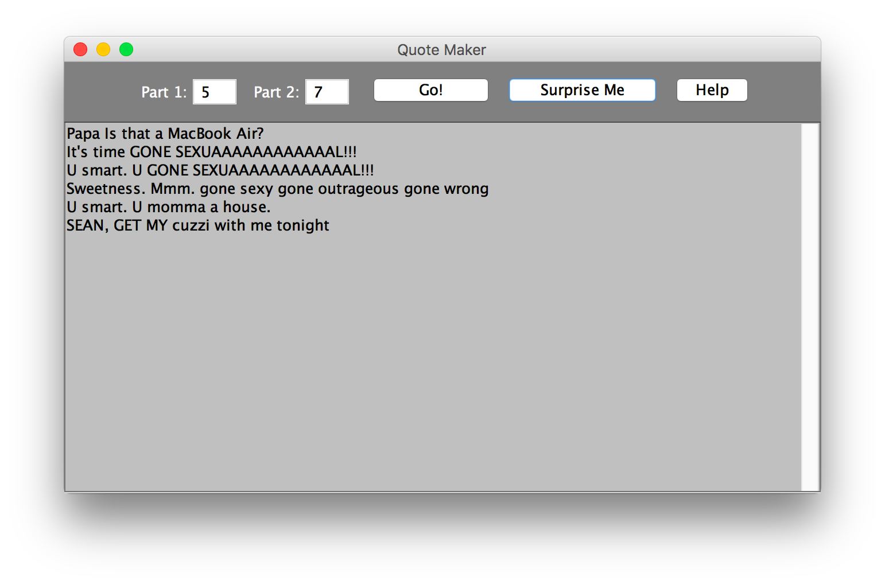
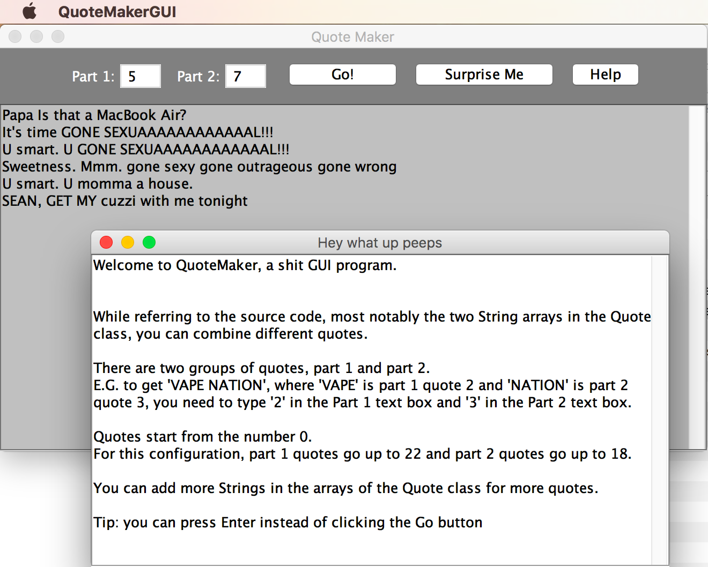
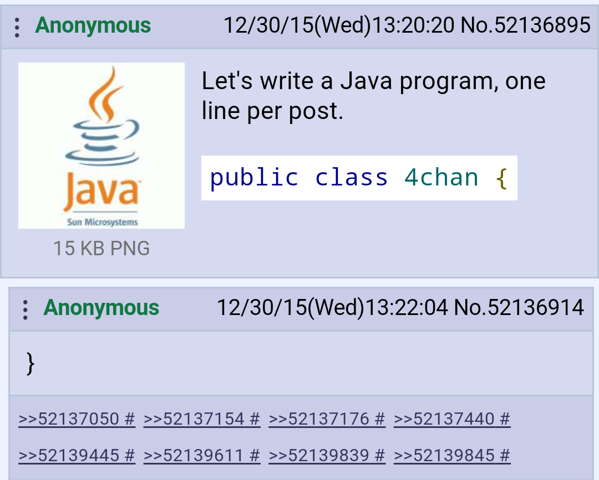

# code
Some of my programming shit. I use Java because that's what I was taught at university. Note: My programming skills suck. All programs here are ridiculously stupid; some on purpose.

Now, I had three hours to spend at university with nothing to do, so here are more details.

### Run these programs in your web browser
You can run `.java` (Java source code) files online with [Ideone](http://ideone.com/). Visit that website, clear everything that appears in the text area, paste the contents of a `.java` file, make sure the programming language is set to Java, and then click on the Run button.    
**Warning**: With Ideone you can't run GUI apps like `QuoteGUI.java`. You can get a pre-compiled version of QuoteGUI in a `.jar` file (see program list below).

### But what about the `.pde` files?
Those are something written with a special integrated development environment and programming language called "Processing", which is basically a programming language for drawings, based on Java. There's also this framework called "p5.js", which is Processing for your web browser that uses JavaScript instead of Java (which are not the same, they're not even similar).    
If you don't want to download and install Processing ([http://processing.org](http://processing.org)), I made p5.js versions of these sketches that you can run on your web browser (see program list below).

### Install the JDK
If you're not lazy, you can compile and run Java programs on your own computer. You need the JDK (Java Standard Edition Development Kit). To install it:
* On Mac, just type `javac` in the Terminal, which will prompt you to install it. If this doesn't work, google "jdk" to download the installer. If you have a Mac OS X version older than 10.7, it may already come with JDK version 6 or older, which is old, but will be fine for my extra basic programs.
* On Linux, type `sudo apt-get install openjdk-8-jdk` in the Terminal. If this doesn’t work, try `sudo pacman -S openjdk-8-jdk`. Or replace `8` with `7`. Otherwise, you know another way to install it.
* On Windows, google “jdk” to download the installer. You’ll also have to set the proper environment variables, [see this video](https://www.youtube.com/watch?v=pV1mm1m58z0). An easier way to install the JDK on Windows is to install the [Chocolatey](https://chocolatey.org/) package manager (which is [useful for other stuff, too](https://chocolatey.org/packages)) and then type `choco install jdk8` in an administrator command prompt. This will automatically download, install, and set the environment variables, like on Mac and Linux.

### Compile & run Java source code files
To compile `.java` files, navigate to the folder they are in using your command prompt/terminal, then type: `javac filename.java` (replace `filename` with the real file name). Or type `javac`, a space, and then drag your `.java` file in the terminal/cmd window. Then, press Enter, of course. This will create one or more `.class` files.    
To run them, look at the source code, note the name of the class followed by the `public static void main(String[] args)` line, and run: `java ClassName` (**without** `.class` at the end, replacing `ClassName` with the real class name).

- - - -

## Java programs

### [FakeIt.java](https://github.com/tcg96/code/blob/master/FakeIt.java)
This program shows you joy by putting a flower through this array (called disarray).

### [FakeItOO.java](https://github.com/tcg96/code/blob/master/FakeItOO.java)
This program shows you joy by putting a Flower through this array (called disarray). Note how Flower is capitalized this time.

### [Quote.java](https://github.com/tcg96/code/blob/master/Quote.java)
Combine h3h3Productions quotes, or customize it with your own quotes.

Welcome screen (no arguments):

Example quote with right arguments, and two examples with wrong arguments:

The third, fourth, fifth…arguments are ignored.

### [QuoteGUI.java](https://github.com/tcg96/code/blob/master/QuoteGUI.java)
A GUI version of QuoteMaker, which can also generate and display random quotes at the press of a button. You can download a [compiled version (.jar file)](https://github.com/tcg96/code/raw/master/QuoteMaker.jar) that you can run without the JDK, as long as you have at least version 8 of the JRE (Java Runtime Environment). If on Linux you get an error saying it's not executable, run `chmod +x QuoteMaker.jar` in the terminal. If you have an older version of the JDK/JRE, it'll still work, but you'll have to compile it yourself (see above), and then run it by typing `java QuoteMakerGUI`.

Should look fine on any OS. Here is an example on Mac OS.

Blank window:

Some example quotes (you can just keep clicking the "Surprise Me" button for random numbers):

The help window:

### [TM3.java](https://github.com/tcg96/code/blob/master/TM3.java)
I’m writing this at 12:54 pm. 1+2+5+4 = 12, which is a multiple of 3. What are all the other times which are multiples of 3?

### [The.java](https://github.com/tcg96/code/blob/master/The.java)
Combination of these two dank-ass memes:

### [echo.java](https://github.com/tcg96/code/blob/master/echo.java)
Because the `echo` command built into any shell isn’t good enough.

- - - -

## Processing sketches

### [sketch_170405a](https://github.com/tcg96/code/blob/master/sketch_170405a)
A very basic Processing sketch that re-creates that trailing window effect when Windows locks up. [It works like this web page](http://mrdoob.com/lab/javascript/effects/ie6/), except it's a different picture. [Error message was generated here](http://atom.smasher.org/error), the text is a quote from the video game "Grand Theft Auto: San Andreas".    
[Click here to run the p5.js version in your web browser](http://tcg96.github.io/p5/Ass).

### [Patreon logo](https://github.com/tcg96/code/blob/master/PatreonLogo)
The new Patreon logo is so basic, I knew I could replicate it in Processing in less than 5 minutes. Eventually, I spent an hour trying to make it look as accurate as possible and adding the versions with other colors (as shown on their [guidelines page](https://www.patreon.com/brand/guidelines)), but it's not perfect.    
[Click here to run the p5.js version in your web browser](http://tcg96.github.io/p5/PatreonLogo).

### More p5.js tests
[Clock](http://tcg96.github.io/p5/clock) and [Maze](http://tcg96.github.io/p5/maze) are slightly modified versions of some p5.js sketches by Daniel Shiffman ("[The Coding Train](http://youtube.com/user/shiffman)" on YouTube).